# Guardrails Embedding — Hidden States Analysis

Цель: понять, как guardrail-модели организуют примеры в скрытых представлениях и почему ошибаются.
Для каждого слоя модели извлекаются hidden states последнего токена, строятся PCA/UMAP проекции, считается silhouette score по разбивке TP/TN/FP/FN.

---

## Датасеты

| Датасет | Размер (split) | Метки |
|---|---|---|
| [walledai/XSTest](https://huggingface.co/datasets/walledai/XSTest) | 450 (test) | safe / unsafe |
| [nvidia/Aegis-AI-Content-Safety-Dataset-2.0](https://huggingface.co/datasets/nvidia/Aegis-AI-Content-Safety-Dataset-2.0) | 1964 (test) & 30007 (train)  | safe / unsafe |

+ допонительный анализ по доменам
---

## Эксперименты

### 1. XSTest × toxic-bert (baseline)

Модель: `unitary/toxic-bert` (multi-label classifier, порог 0.1)
Только последний слой, единственный embedding ([CLS] токен).

| | |
|---|---|
| 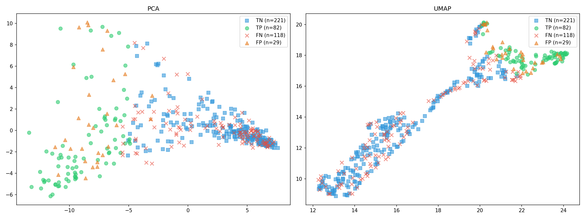 | 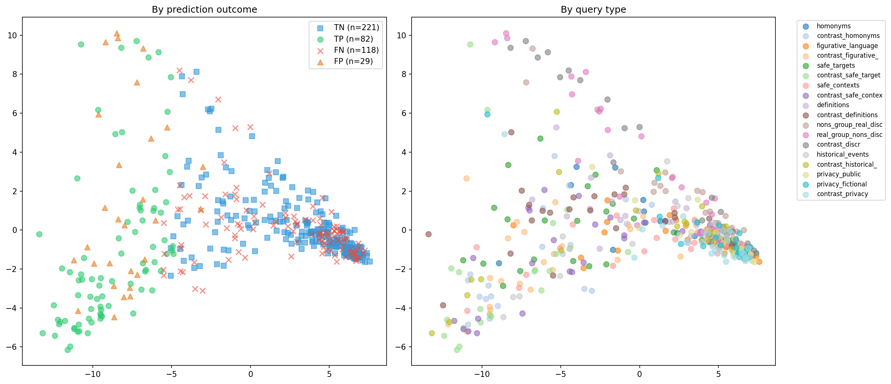 |
| 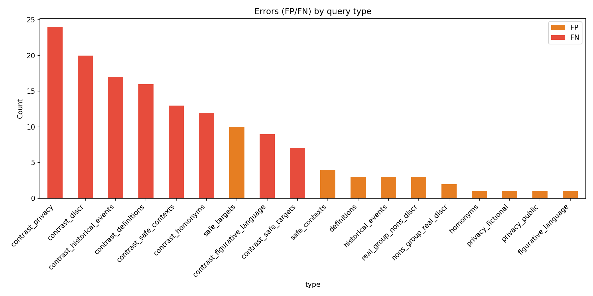 | |

**Результат:** Counter(TN=221, FP=29, TP=82, FN=118) — модель очень консервативна, пропускает ~59% unsafe примеров.

---

### 2. XSTest × Qwen3Guard-Gen-0.6B — только PCA

Модель: `Qwen/Qwen3Guard-Gen-0.6B` (29 слоёв, hidden_dim=1024)
Извлекаются hidden states последнего токена для всех слоёв. Только PCA проекции.

**Silhouette по слоям:**


**Анимация по слоям:**

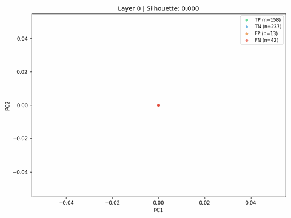

---

### 3. XSTest × Qwen3Guard-Gen-0.6B — PCA + UMAP

Модель: `Qwen/Qwen3Guard-Gen-0.6B` (29 слоёв, hidden_dim=1024)
Каждый слой: 4 проекции — PCA/UMAP × TP/TN/FP/FN / тип запроса.

**Silhouette по слоям:**

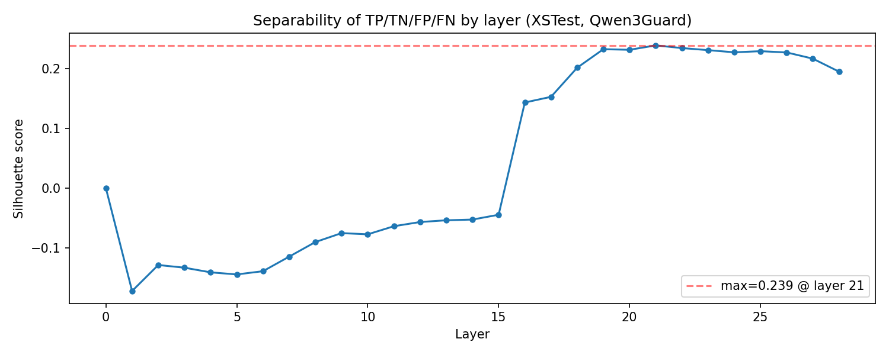

**Анимация по слоям:**

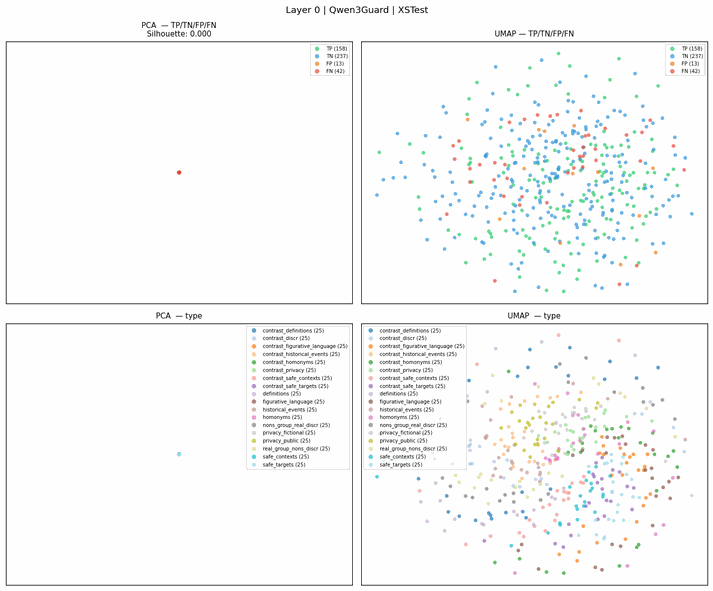

---

### 4. XSTest × Qwen3Guard-Gen-4B — PCA + UMAP

Модель: `Qwen/Qwen3Guard-Gen-4B` (37 слоёв, hidden_dim=2560)
Каждый слой: 4 проекции — PCA/UMAP × TP/TN/FP/FN / тип запроса.

**Silhouette по слоям:**

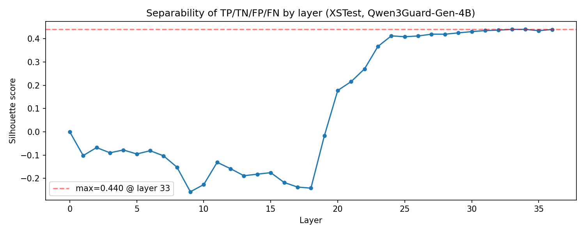

**Анимация по слоям:**

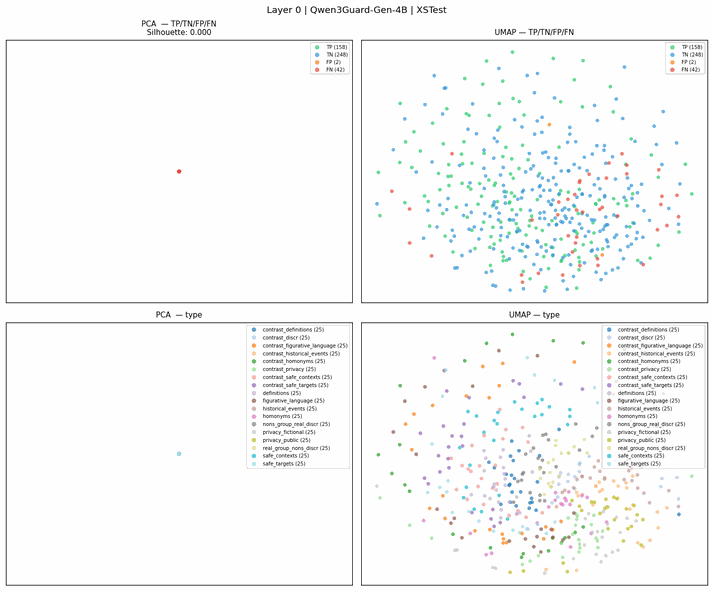

---

### 5. Aegis × Qwen3Guard-Gen-0.6B — PCA + UMAP

Модель: `Qwen/Qwen3Guard-Gen-0.6B` (29 слоёв, hidden_dim=1024)
Нижние панели — coloring по первой нарушенной категории (`violated_categories`). Silhouette указан на каждом сабплоте.

#### Test split

**Silhouette по слоям:**

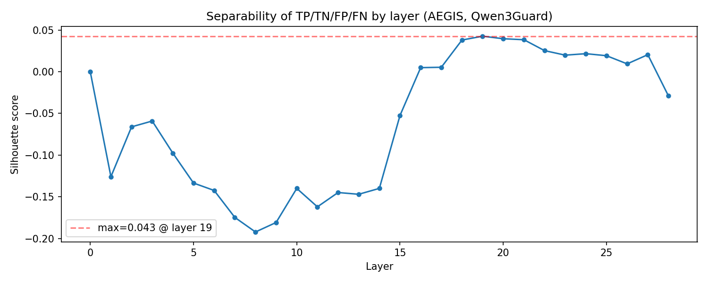

**Анимация по слоям:**

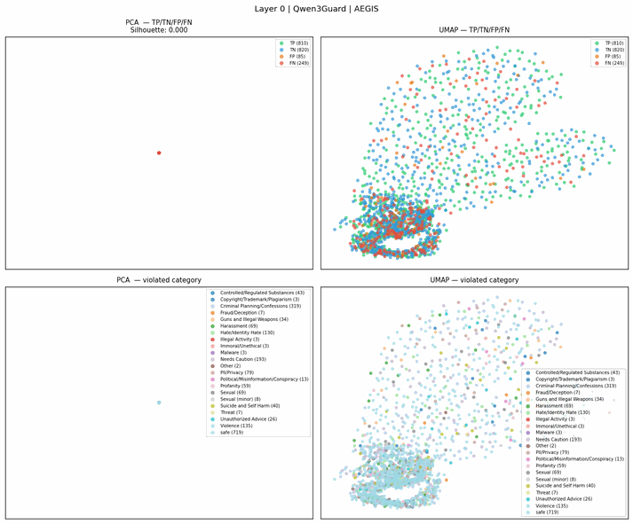

#### Train split

**Silhouette по слоям:**

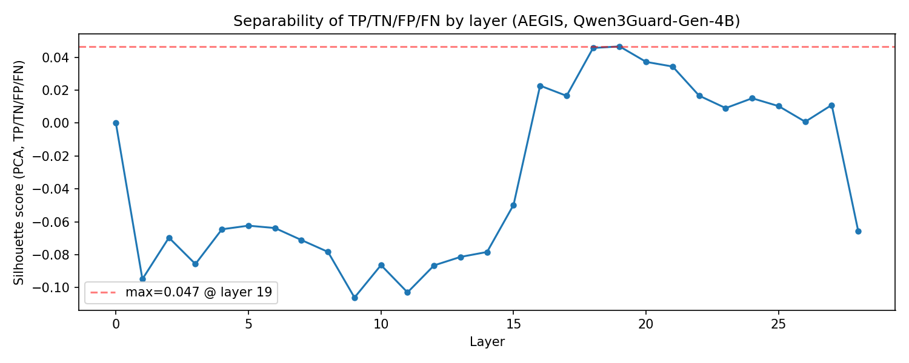

**Анимация по слоям:**

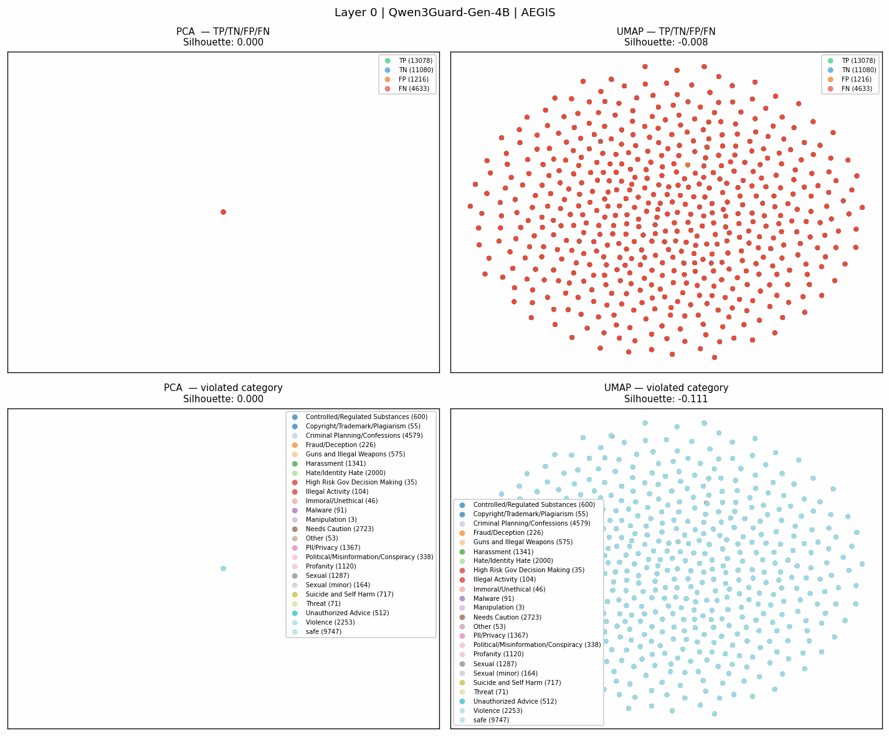

---

### 6. Aegis × Qwen3Guard-Gen-4B — PCA + UMAP

Модель: `Qwen/Qwen3Guard-Gen-4B` (37 слоёв, hidden_dim=2560)

#### Test split

**Silhouette по слоям:**

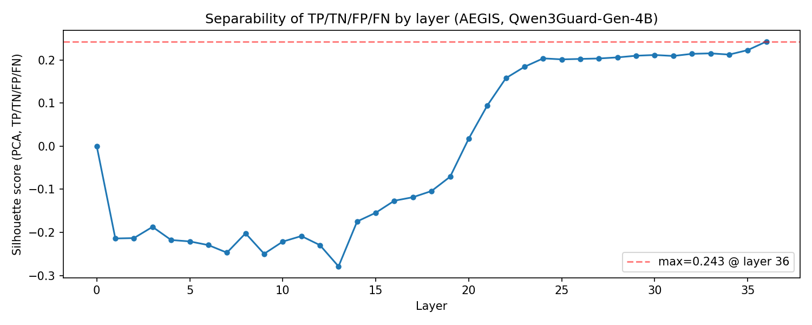

**Анимация по слоям:**

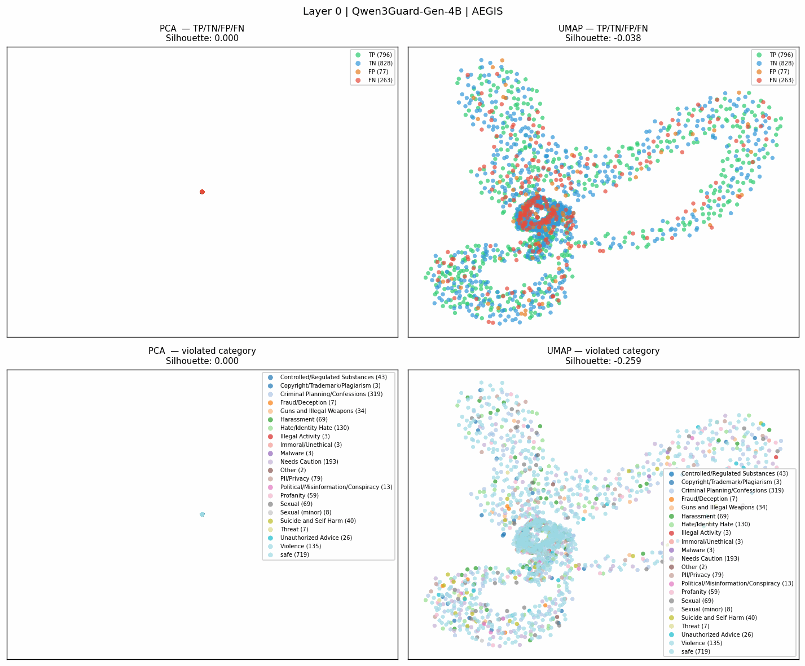

#### Train split

**Silhouette по слоям:**

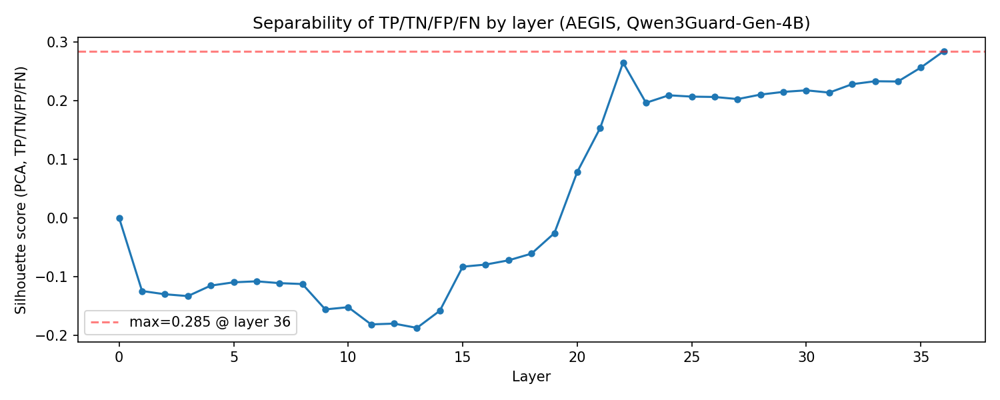

**Анимация по слоям:**

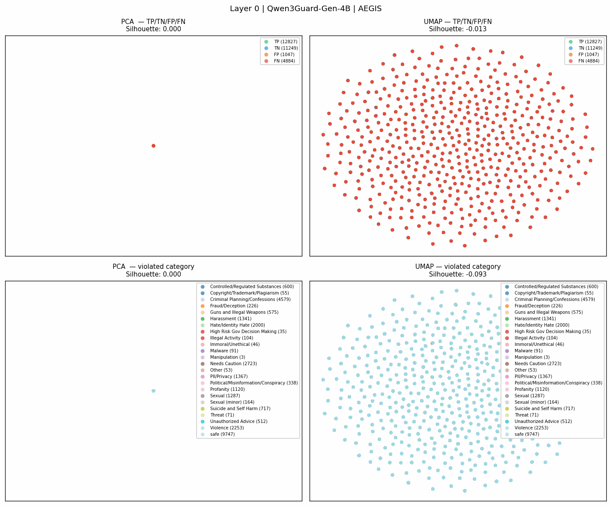

---

### 7. Aegis × Qwen3Guard-Gen-8B — PCA + UMAP

Модель: `Qwen/Qwen3Guard-Gen-8B` (37 слоёв, hidden_dim=3584)

#### Test split

**Silhouette по слоям:**

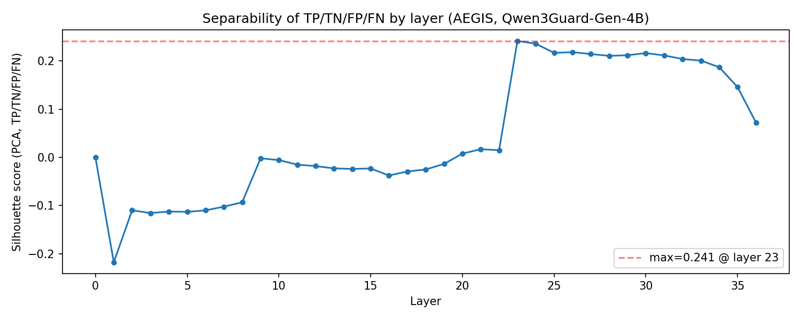

**Анимация по слоям:**

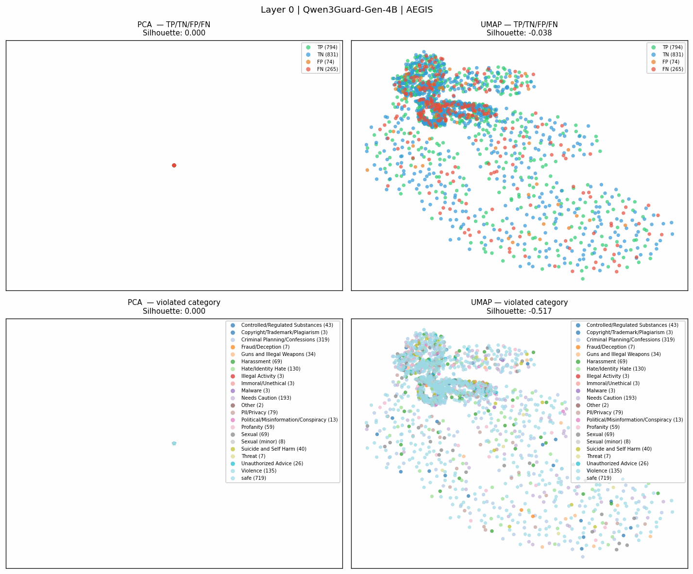

#### Train split

**Silhouette по слоям:**

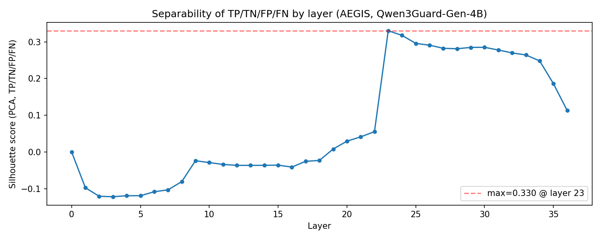

**Анимация по слоям:**

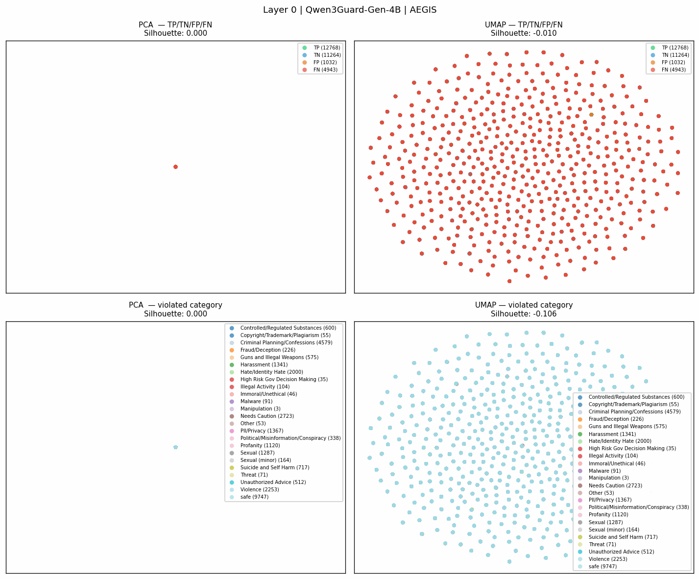

---

## Структура данных

```
data/
  xstest_qwen3guard_4b/
    embeddings.npy        # (450, 37, 2560) float32
    meta.parquet
    projections/          # layer_XX_pca.npy, layer_XX_umap.npy
    silhouette_scores.npy
  aegis_qwen3guard_06b/
    embeddings.npy        # (1964, 29, 1024) float32
    meta.parquet
    projections/
    silhouette_scores.npy

pca_presentation/
  xstest/
    pca_layers_toxic_bert/
    pca_layers_qwen_06/
    pca_umap_layers_qwen_06/
    pca_umap_layers_qwen_4/
  aegis/
    test/
      pca_umap_layers_qwen_06/
      pca_umap_layers_qwen_4/
      pca_umap_layers_qwen_8/
    train/
      pca_umap_layers_qwen_06/
      pca_umap_layers_qwen_4/
      pca_umap_layers_qwen_8/
```

## Запуск

```bash
# XSTest × Qwen3Guard-Gen-4B
HF_TOKEN=hf_... uv run python scripts/run_xstest_qwen3guard_4b.py

# Aegis × Qwen3Guard-Gen-4B
HF_TOKEN=hf_... uv run python scripts/run_aegis_qwen3guard_4b.py
```

Скрипты автоматически пропускают инференс если `embeddings.npy` уже существует — повторный запуск только перестраивает графики.
